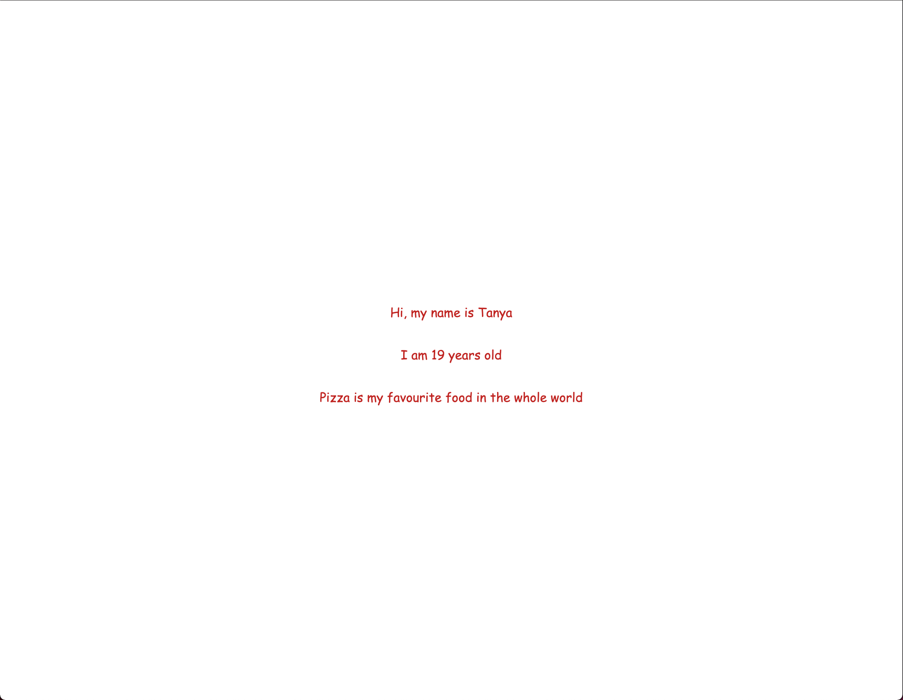

# React Components Example

When running the `create-react-app` command the following is happening:

- It's downloading and installing all the 3rd party dependencies required for a create application onto our machines so they are available for us to use.
  - The dependencies will live in a folder called `node_modules`
- Using all of the dependencies, the scaffolding of a react application is formed and we can begin creating our very own react app

## What does this example do?

This example creates a component called `Biography`. Inside of the `index.js` there are comments explaining everything that is happening.
If you build this app you should see the below in the browser

